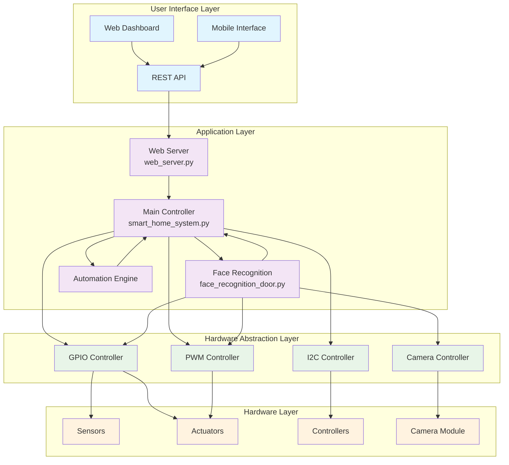
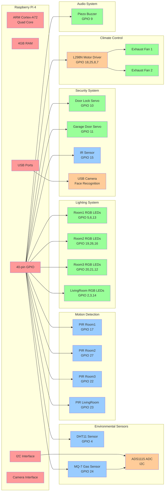
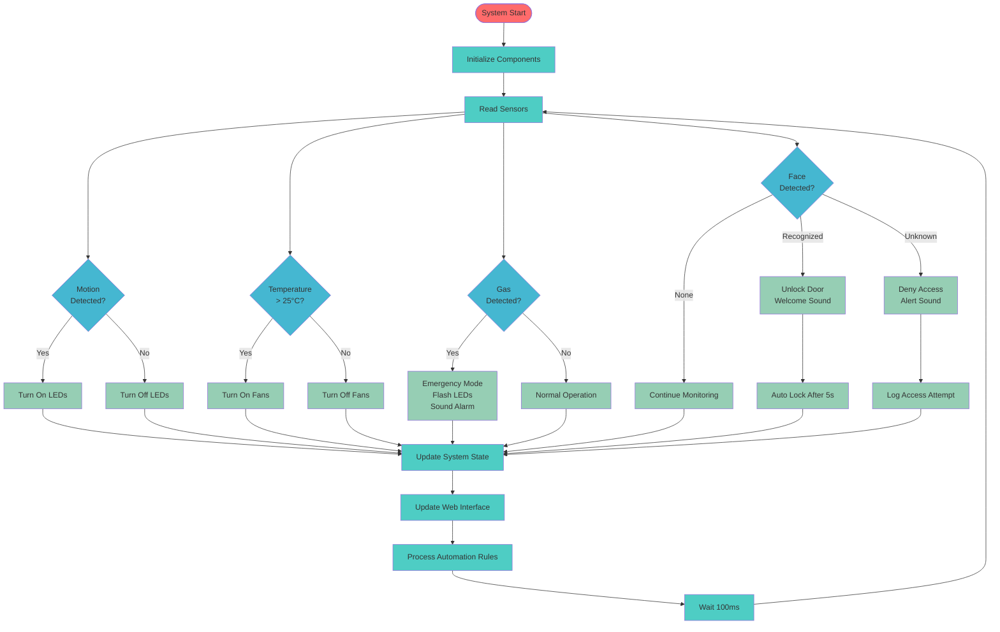
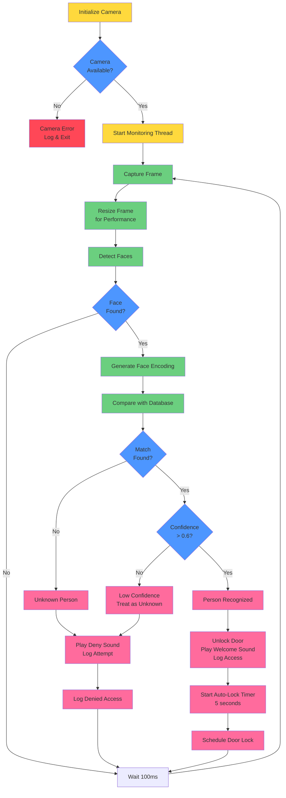
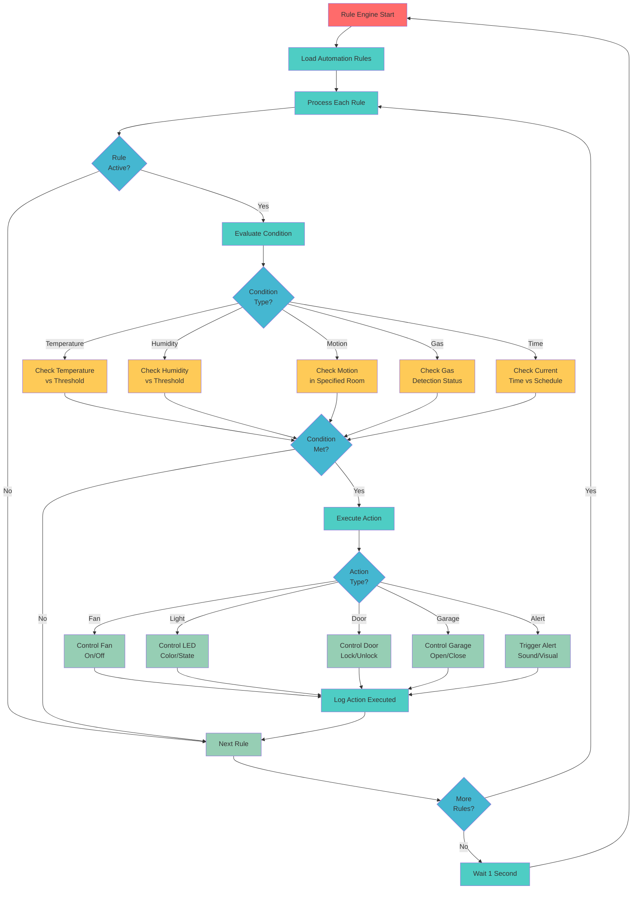
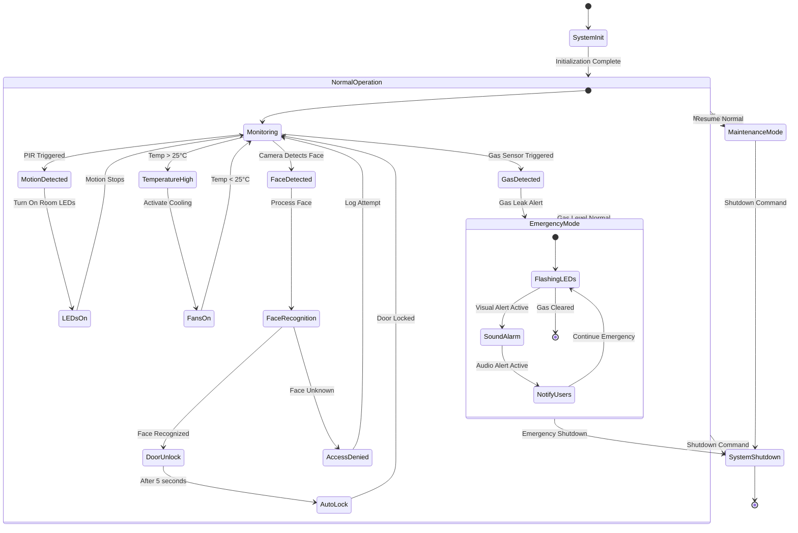
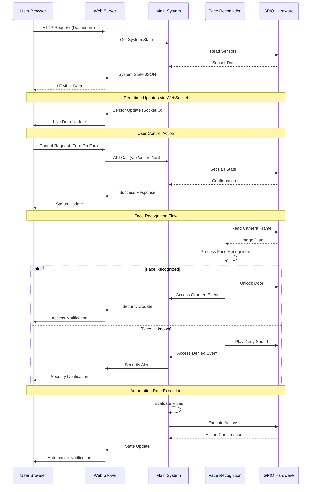

# Smart Home System Architecture Diagrams

This document contains comprehensive Mermaid.js diagrams illustrating the architecture, data flow, and component relationships of the Smart Home Automation System.

## 1. Overall System Architecture



## 2. Hardware Component Diagram



## 3. Data Flow Diagram



## 4. Face Recognition System Flow



## 5. GPIO Pin Assignment Diagram

```mermaid
graph LR
    subgraph "Raspberry Pi GPIO"
        GPIO2[GPIO 2<br/>Pin 3]
        GPIO3[GPIO 3<br/>Pin 5]
        GPIO4[GPIO 4<br/>Pin 7]
        GPIO5[GPIO 5<br/>Pin 29]
        GPIO6[GPIO 6<br/>Pin 31]
        GPIO7[GPIO 7<br/>Pin 26]
        GPIO8[GPIO 8<br/>Pin 24]
        GPIO9[GPIO 9<br/>Pin 21]
        GPIO10[GPIO 10<br/>Pin 19]
        GPIO11[GPIO 11<br/>Pin 23]
        GPIO12[GPIO 12<br/>Pin 32]
        GPIO13[GPIO 13<br/>Pin 33]
        GPIO14[GPIO 14<br/>Pin 8]
        GPIO15[GPIO 15<br/>Pin 10]
        GPIO16[GPIO 16<br/>Pin 36]
        GPIO17[GPIO 17<br/>Pin 11]
        GPIO18[GPIO 18<br/>Pin 12]
        GPIO19[GPIO 19<br/>Pin 35]
        GPIO20[GPIO 20<br/>Pin 38]
        GPIO21[GPIO 21<br/>Pin 40]
        GPIO22[GPIO 22<br/>Pin 15]
        GPIO23[GPIO 23<br/>Pin 16]
        GPIO24[GPIO 24<br/>Pin 18]
        GPIO25[GPIO 25<br/>Pin 22]
        GPIO26[GPIO 26<br/>Pin 37]
        GPIO27[GPIO 27<br/>Pin 13]
    end
    
    subgraph "Components"
        LR_RED[LivingRoom Red LED]
        LR_GREEN[LivingRoom Green LED]
        DHT[DHT11 Sensor]
        R1_RED[Room1 Red LED]
        R1_GREEN[Room1 Green LED]
        MOTOR_B4[Motor B IN4]
        MOTOR_B3[Motor B IN3]
        BUZZER_COMP[Piezo Buzzer]
        DOOR_SERVO_COMP[Door Servo]
        GARAGE_SERVO_COMP[Garage Servo]
        R3_BLUE[Room3 Blue LED]
        R1_BLUE[Room1 Blue LED]
        LR_BLUE[LivingRoom Blue LED]
        IR_COMP[IR Sensor]
        R2_BLUE[Room2 Blue LED]
        PIR_R1[PIR Room1]
        MOTOR_A1[Motor A IN1]
        R2_RED[Room2 Red LED]
        R3_RED[Room3 Red LED]
        R3_GREEN[Room3 Green LED]
        PIR_R3[PIR Room3]
        PIR_LR[PIR LivingRoom]
        GAS_COMP[Gas Sensor]
        MOTOR_A2[Motor A IN2]
        R2_GREEN[Room2 Green LED]
        PIR_R2[PIR Room2]
        I2C_SDA[I2C SDA]
        I2C_SCL[I2C SCL]
    end
    
    %% GPIO to Component connections
    GPIO2 --> LR_RED
    GPIO2 --> I2C_SDA
    GPIO3 --> LR_GREEN
    GPIO3 --> I2C_SCL
    GPIO4 --> DHT
    GPIO5 --> R1_RED
    GPIO6 --> R1_GREEN
    GPIO7 --> MOTOR_B4
    GPIO8 --> MOTOR_B3
    GPIO9 --> BUZZER_COMP
    GPIO10 --> DOOR_SERVO_COMP
    GPIO11 --> GARAGE_SERVO_COMP
    GPIO12 --> R3_BLUE
    GPIO13 --> R1_BLUE
    GPIO14 --> LR_BLUE
    GPIO15 --> IR_COMP
    GPIO16 --> R2_BLUE
    GPIO17 --> PIR_R1
    GPIO18 --> MOTOR_A1
    GPIO19 --> R2_RED
    GPIO20 --> R3_RED
    GPIO21 --> R3_GREEN
    GPIO22 --> PIR_R3
    GPIO23 --> PIR_LR
    GPIO24 --> GAS_COMP
    GPIO25 --> MOTOR_A2
    GPIO26 --> R2_GREEN
    GPIO27 --> PIR_R2
    
    %% Styling
    classDef gpioClass fill:#ff9999
    classDef ledClass fill:#99ff99
    classDef sensorClass fill:#99ccff
    classDef motorClass fill:#ffcc99
    classDef servoClass fill:#cc99ff
    classDef i2cClass fill:#ffff99
    
    class GPIO2,GPIO3,GPIO4,GPIO5,GPIO6,GPIO7,GPIO8,GPIO9,GPIO10,GPIO11,GPIO12,GPIO13,GPIO14,GPIO15,GPIO16,GPIO17,GPIO18,GPIO19,GPIO20,GPIO21,GPIO22,GPIO23,GPIO24,GPIO25,GPIO26,GPIO27 gpioClass
    class LR_RED,LR_GREEN,R1_RED,R1_GREEN,R1_BLUE,LR_BLUE,R2_BLUE,R2_RED,R3_RED,R3_GREEN,R3_BLUE,R2_GREEN ledClass
    class DHT,PIR_R1,PIR_R2,PIR_R3,PIR_LR,GAS_COMP,IR_COMP sensorClass
    class MOTOR_A1,MOTOR_A2,MOTOR_B3,MOTOR_B4 motorClass
    class DOOR_SERVO_COMP,GARAGE_SERVO_COMP,BUZZER_COMP servoClass
    class I2C_SDA,I2C_SCL i2cClass
```



## 6. Web Interface Architecture

```mermaid
graph TB
    subgraph "Frontend"
        DASHBOARD[Dashboard Page<br/>dashboard.html]
        CONTROLS[Controls Page<br/>controls.html]
        AUTOMATION[Automation Page<br/>automation.html]
        MONITORING[Monitoring Page<br/>monitoring.html]
        SETTINGS[Settings Page<br/>settings.html]
    end
    
    subgraph "Static Assets"
        CSS[Stylesheets<br/>style.css]
        JS[JavaScript<br/>main.js]
        AUTO_JS[Automation JS<br/>automation.js]
    end
    
    subgraph "Backend API"
        FLASK[Flask Server<br/>Port 5000]
        SOCKETIO[SocketIO<br/>Real-time Updates]
    end
    
    subgraph "API Endpoints"
        STATE_API[/api/state]
        CONTROL_API[/api/control/*]
        RULES_API[/api/rules/*]
        FACE_API[/api/face/*]
        SYSTEM_API[/api/system/*]
    end
    
    subgraph "Core System"
        MAIN_SYS[Main System<br/>smart_home_system.py]
        FACE_SYS[Face Recognition<br/>face_recognition_door.py]
    end
    
    %% Frontend connections
    DASHBOARD --> CSS
    DASHBOARD --> JS
    CONTROLS --> CSS
    CONTROLS --> JS
    AUTOMATION --> CSS
    AUTOMATION --> AUTO_JS
    MONITORING --> CSS
    MONITORING --> JS
    SETTINGS --> CSS
    SETTINGS --> JS
    
    %% Frontend to Backend
    DASHBOARD --> FLASK
    CONTROLS --> FLASK
    AUTOMATION --> FLASK
    MONITORING --> FLASK
    SETTINGS --> FLASK
    
    %% Real-time updates
    FLASK --> SOCKETIO
    SOCKETIO --> DASHBOARD
    SOCKETIO --> CONTROLS
    SOCKETIO --> MONITORING
    
    %% API connections
    FLASK --> STATE_API
    FLASK --> CONTROL_API
    FLASK --> RULES_API
    FLASK --> FACE_API
    FLASK --> SYSTEM_API
    
    %% Backend to Core System
    STATE_API --> MAIN_SYS
    CONTROL_API --> MAIN_SYS
    RULES_API --> MAIN_SYS
    FACE_API --> FACE_SYS
    SYSTEM_API --> MAIN_SYS
    
    %% System integration
    MAIN_SYS --> FACE_SYS
    FACE_SYS --> MAIN_SYS
    
    %% Styling
    classDef frontendClass fill:#e3f2fd
    classDef staticClass fill:#f3e5f5
    classDef backendClass fill:#e8f5e8
    classDef apiClass fill:#fff3e0
    classDef systemClass fill:#fce4ec
    
    class DASHBOARD,CONTROLS,AUTOMATION,MONITORING,SETTINGS frontendClass
    class CSS,JS,AUTO_JS staticClass
    class FLASK,SOCKETIO backendClass
    class STATE_API,CONTROL_API,RULES_API,FACE_API,SYSTEM_API apiClass
    class MAIN_SYS,FACE_SYS systemClass
```

## 7. Automation Rules Engine



## 8. System State Management



## 9. Network Communication Flow



## 10. File Structure and Dependencies

```mermaid
graph TD
    subgraph "Core System Files"
        MAIN_PY[smart_home_system.py<br/>Main Controller]
        WEB_PY[web_server.py<br/>Web Interface]
        FACE_PY[face_recognition_door.py<br/>Face Recognition]
    end
    
    subgraph "Configuration Files"
        REQ_TXT[requirements.txt<br/>Dependencies]
        FACE_REQ[face_recognition_requirements.txt<br/>Face Recognition Deps]
        WEB_REQ[web_requirements.txt<br/>Web Dependencies]
        RULES_JSON[automation_rules.json<br/>Automation Rules]
    end
    
    subgraph "Testing Framework"
        TEST_MOTION[test_motion_detection.py]
        TEST_TEMP[test_temperature_fan.py]
        TEST_GAS[test_gas_detection.py]
        TEST_FACE[test_face_recognition.py]
        TEST_SYSTEM[test_system_connectivity.py]
        VERIFY[verify_system.py]
    end
    
    subgraph "Documentation"
        README[README.md]
        HARDWARE_DOC[hardware_documentation.md]
        COMPREHENSIVE[COMPREHENSIVE_SYSTEM_DOCUMENTATION.md]
        WIRING[HARDWARE_WIRING_COMPATIBILITY_REPORT.md]
        DIAGRAMS[SYSTEM_ARCHITECTURE_DIAGRAMS.md]
    end
    
    subgraph "Web Interface"
        TEMPLATES[templates/<br/>HTML Files]
        STATIC[static/<br/>CSS/JS Files]
        BASE_HTML[base.html]
        DASHBOARD_HTML[dashboard.html]
        STYLE_CSS[style.css]
        MAIN_JS[main.js]
    end
    
    subgraph "Setup Scripts"
        SETUP_PI[setup_raspberry_pi.sh]
        SETUP_FACE[setup_face_recognition.sh]
    end
    
    subgraph "Data Files"
        FACE_DB[face_database.pkl<br/>Face Encodings]
        ACCESS_LOG[access_log.json<br/>Access History]
        SYSTEM_LOG[system.log<br/>System Events]
    end
    
    %% Dependencies
    MAIN_PY --> REQ_TXT
    FACE_PY --> FACE_REQ
    WEB_PY --> WEB_REQ
    MAIN_PY --> RULES_JSON
    
    %% System Integration
    WEB_PY --> MAIN_PY
    FACE_PY --> MAIN_PY
    MAIN_PY --> FACE_PY
    
    %% Testing Dependencies
    TEST_MOTION --> MAIN_PY
    TEST_TEMP --> MAIN_PY
    TEST_GAS --> MAIN_PY
    TEST_FACE --> FACE_PY
    TEST_SYSTEM --> MAIN_PY
    VERIFY --> MAIN_PY
    
    %% Web Interface Dependencies
    WEB_PY --> TEMPLATES
    TEMPLATES --> BASE_HTML
    TEMPLATES --> DASHBOARD_HTML
    STATIC --> STYLE_CSS
    STATIC --> MAIN_JS
    
    %% Data Dependencies
    FACE_PY --> FACE_DB
    FACE_PY --> ACCESS_LOG
    MAIN_PY --> SYSTEM_LOG
    
    %% Setup Dependencies
    SETUP_PI --> REQ_TXT
    SETUP_FACE --> FACE_REQ
    
    %% Styling
    classDef coreClass fill:#ff9999
    classDef configClass fill:#99ccff
    classDef testClass fill:#99ff99
    classDef docClass fill:#ffcc99
    classDef webClass fill:#cc99ff
    classDef setupClass fill:#ffff99
    classDef dataClass fill:#ff99cc
    
    class MAIN_PY,WEB_PY,FACE_PY coreClass
    class REQ_TXT,FACE_REQ,WEB_REQ,RULES_JSON configClass
    class TEST_MOTION,TEST_TEMP,TEST_GAS,TEST_FACE,TEST_SYSTEM,VERIFY testClass
    class README,HARDWARE_DOC,COMPREHENSIVE,WIRING,DIAGRAMS docClass
    class TEMPLATES,STATIC,BASE_HTML,DASHBOARD_HTML,STYLE_CSS,MAIN_JS webClass
    class SETUP_PI,SETUP_FACE setupClass
    class FACE_DB,ACCESS_LOG,SYSTEM_LOG dataClass
```



---

## Summary

These Mermaid.js diagrams provide a comprehensive visual representation of the Smart Home Automation System, covering:

1. **Overall Architecture** - High-level system layers and components
2. **Hardware Components** - Physical devices and their GPIO connections
3. **Data Flow** - How information moves through the system
4. **Face Recognition Flow** - Detailed face recognition process
5. **GPIO Pin Assignment** - Complete pin mapping visualization
6. **Web Interface Architecture** - Frontend and backend structure
7. **Automation Rules Engine** - Rule processing workflow
8. **System State Management** - State transitions and modes
9. **Network Communication** - Sequence of system interactions
10. **File Structure** - Project organization and dependencies

Each diagram uses proper Mermaid.js syntax with appropriate arrows, styling, and relationships to clearly illustrate the system's architecture and operation. 